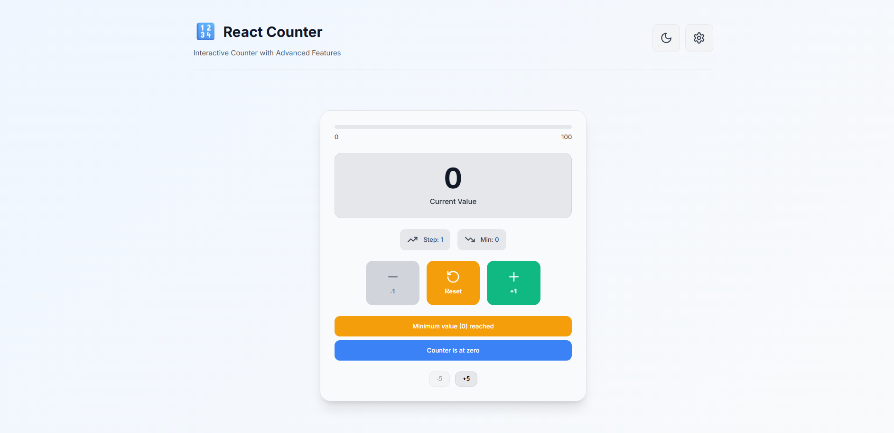
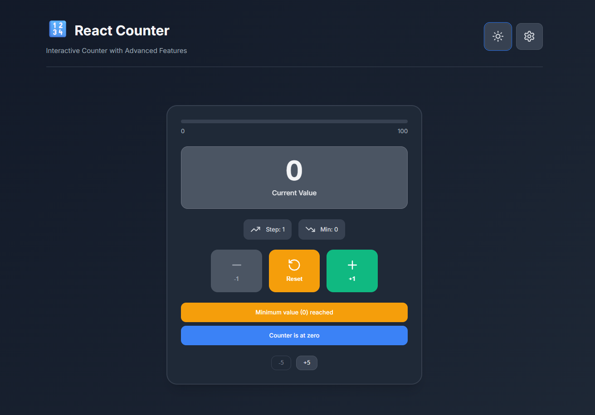
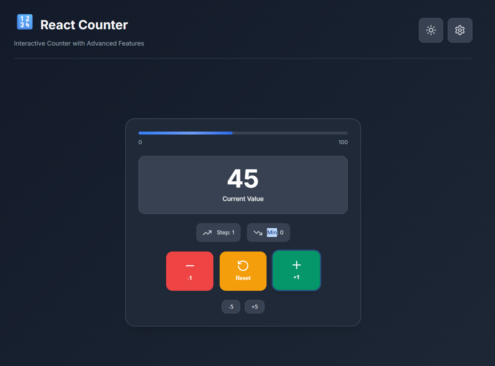
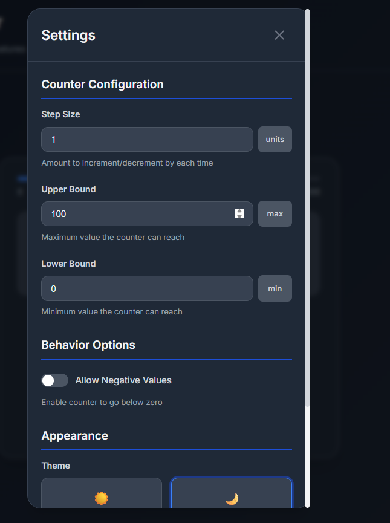

Project Title & Objective

Project Title: Interactive React Counter Application with Advanced UI/UX

1.Objective:
To create a modern, interactive counter app in React that not only demonstrates state management, event handling, and conditional rendering, but also applies advanced UI/UX principles — making learning React feel less like “just another tutorial” and more like building something professional and fun.

2.Brief Description

What the app does:
This isn’t your boring “+ / – / reset” counter. The app lets you:

Increment, decrement, and reset with custom step sizes

Set upper and lower limits

Toggle negative values

Watch a progress bar fill up as you count

Switch between light and dark themes with smooth transitions

Why I built it:
I wanted hands-on experience with React’s core concepts. Instead of following a plain example, I decided to push a basic counter into something polished, responsive, and user-friendly — while learning real-world techniques like localStorage persistence, theming with CSS variables, and mobile-first design.

3.GitHub Repository : https://github.com/nishantkashyap-07/React-counter.git

Technologies Used

React – Component-based UI framework

JavaScript (ES6+) – App logic and interactivity

HTML5 – Semantic structure

CSS3 – Styling, themes, animations, responsive layout

How to Run the App Locally

Prerequisites:

Node.js (14+)

npm or yarn

Steps:

# Clone the repo
git clone https://github.com/yourusername/react-counter-app.git
cd react-counter-app

# Install dependencies
npm install

# Run development server
npm start

Open your browser at http://localhost:3000.

---Challenges Faced & Solutions
1. App Wouldn’t Start (Dependency Issue)

Problem: Weird ajv module not found error.

Solution: Updated ajv to v8.x in devDependencies — fixed startup instantly.

2. Managing Multiple States

Problem: Too many useState hooks for counter value, limits, theme, etc.

Solution: Centralized state in App.js and synced settings to localStorage with useEffect.

3. Mobile Layout Issues

Problem: Buttons too small, layout broken on phones.

Solution: Mobile-first CSS with Flexbox/Grid and 44px+ touch targets.

4. Theme Switching

Problem: Wanted smooth, persistent theme changes.

Solution: Used CSS variables + localStorage for preference storage.

5. Bounds Validation

Problem: Users could set invalid ranges.

Solution: Wrote validation functions + visual feedback to prevent errors.

Screenshots of the Application UI

### Light Theme - Main Interface

Main counter interface in light theme showing the large counter display, action buttons, and progress bar

### Dark Theme - Settings Modal

Settings modal in dark theme with configuration options for step size, bounds, and theme selection

### Mobile Responsive Design

Mobile-optimized interface with stacked layout and touch-friendly buttons

### Counter States

Different counter states: positive (green), negative (red), and zero (neutral)

### Progress Visualization

Progress bar showing counter position within configured bounds

Feature List

Core Features

Counter display with color-coded values (positive/negative/zero)

Increment / Decrement buttons

Reset to zero

Custom step size (1–100)

Configurable upper/lower bounds

Option to allow negative values

Automatic button disabling at limits

Advanced UI/UX Features

Progress bar showing counter position

Light & dark theme with smooth transitions

Fully responsive design

Real-time status messages

Quick increment/decrement (5× step size)

Settings modal for customization

Persistent settings with localStorage

Accessibility

Full keyboard navigation

Screen reader support (ARIA labels)

High-contrast colors & focus indicators

Touch-friendly buttons